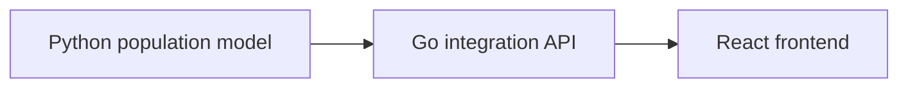

# Architecture

This PoC uses a deliberately simple three-service shape.

## Python Model

The model owns simulation state.

It exposes:

- `GET /health`
- `GET /snapshot`
- `POST /step`
- `POST /reset`

The model advances automatically on a timer and can also be stepped manually.

## Go API

The API is the integration boundary.

It reads from the model and exposes frontend-facing endpoints:

- `GET /api/health`
- `GET /api/snapshot`
- `POST /api/step`
- `POST /api/reset`

In a real system, this layer would be responsible for stronger contracts, validation, orchestration, auth, observability, and cross-system error handling.

## React Frontend

The frontend polls `GET /api/snapshot` and renders agents on a 2D lattice.

In a real system, this could evolve into a scenario control surface, live exercise monitor, simulation debugger, or operational visualisation.

